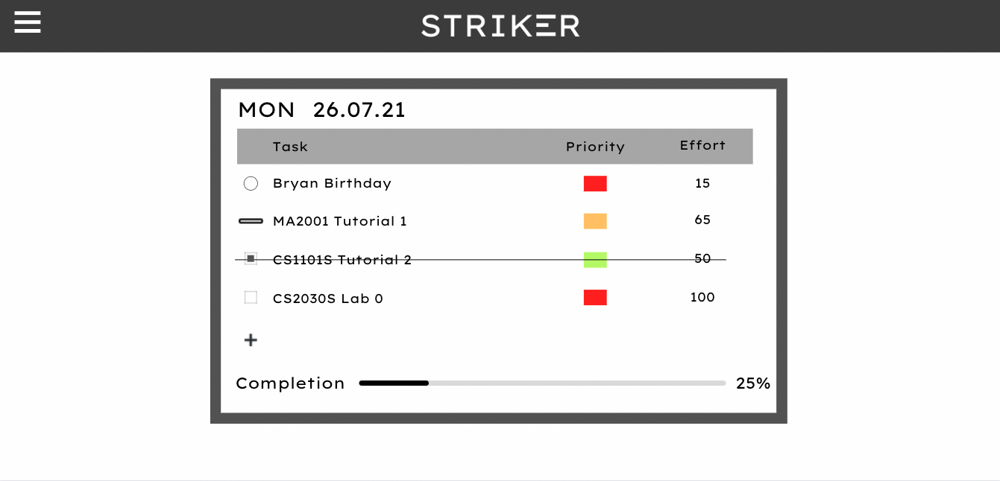
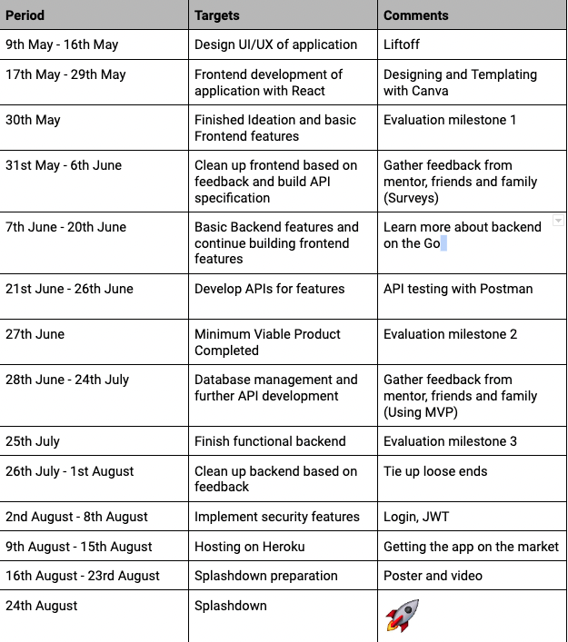

# Milestone 1 Submission

## Team Name:

Head in the Clouds

## Proposed Level of Achievement:

Artemis

## Project Scope

Striker is a task manager application that focuses on seamless design, user analytics and user productivity.

## Motivation

We intend to build a web application titled “STRIKER”. It is a task manager application grounded on the principles of simplicity and intentionality. Inspired by the concept of bullet journaling by Ryder Carroll, we hope to bring to life a virtual, analytically-driven task manager. Our hope is to create an application that is simple to use, while providing as much useful insights and functionality to our users to boost their day-to-day productivity.

## Rationale

The rationale for wanting to build such an application is the surplus of unstructured task manager applications with excessive flexibility and superfluous customisations. These are all too confusing and intimidating to new users and people who simply wish to use an online task manager. As such, we hope STRIKER will bridge this gap, by providing the much needed structure and simplicity.

## Overview

The structure of STRIKER is simple - tasks are categorised into 3 levels of priority - high, medium and low. Strike through each task once completed. The intentionality lies not only in planning the to-dos for the day but also in short bullet points. This allows users to pen down only the essentials and strip away the unnecessary. When users write excessively, it might seem like there is so much to accomplish. They become swamped and are overly busy. STRIKER aims to help users become more productive and weed out such distractions by being mindful and by prioritising what is important.

## Features

Beyond the simple features of bullet tasking and striking off feature, STRIKER has the ability to filter the task list and show tasks are pending completion and those that are done. This gives users a quick birds eye view of the various types of tasks without having to scroll through the entire list and make mental notes. When creating a task, the user also has the option to choose the urgency of the task, denoted by the colours, as well as the nature of the task ( ie event, todo, reminder) represented by the 3 different shapes. The user can also add a deadline and the striker app will remind the user of this impending deadline.

In addition, if the user feels like assigning to-dos for the future, they can access the calendar feature and select the date to jot them down. This also opens up a feature of reviewing the users’ history to view completed, uncompleted and deleted tasks. An additional feature of the calendar’s user interface is the ability to drop and drop tasks from one date to another. The home page will always display the to-dos for the current day.

We also have a Monthly Log feature. At the start of each month, Striker will prompt users to pen down tasks that they want to accomplish for the month. They will also be prompted to carry forward any unfinished tasks from the previous month. Every day, users will be able to drag and drop tasks from the monthly log to the current day’s task.

Not forgetting the user analytics page where users can track their progress. A personalised dashboard highlighting the percentage of tasks completed daily, monthly and throughout the span of using STRIKER. This would allow users to track their productivity. For added customization, the user would also be able to select specific date ranges to track his productivity during that period.

Moving forward, we hope to tap into the treasure trove of data collected and provide useful insights to the users. For example, we can compare the number of tasks the user logs daily against the optimal number of tasks logged based on all our users (highest completion rate). This will give us an indication of how well the user fairs and provide suggestions on how to improve the user’s productivity. We believe that our application will be able to collect large amounts of usable data from our users and ideally we can use this data to provide useful insights for our users to be more productive in their day-to-day planning.

In addition, we will have a plugin feature list that provides more flexibility to the user to use whatever productivity framework he/she would like. Some of the frameworks that we will support are the Eisenhower matrix and the 1-3-5 workflow.

## Summary of Features

- Colour coding of tasks to indicate urgency
- Different shapes to indicate nature of task
- Filter completed/uncompleted tasks on home page
- Deadline setter for individual tasks with prompted reminders/ push notification
- Edit option to delete task or change task text
- Calendar feature to plan for future and review the past
- Drag and drop feature of tasks in calendar mode
- Monthly Log feature that allows you to pen down tasks you want to accomplish for each month
- Progress feature to show user’s productivity analytics
- Customizability in productivity analytics
- Framework plugin feature

  
Striker Mockup

## User Stories

1. User Story in general for STRIKER  
   As a university student, I want to note down all my tasks for the day, so I can work productively and declutter his mind.

2. User Story for filter view  
   As a university student, I want to review the tasks I have yet to complete because I want to prepare my tasks for the next day.

3. User Story for priority button  
   As a university student, I want to organise my tasks in order of priority (high, medium, low) so as to keep me focused on the urgent things I need to complete.

4. User Story for deleted tab  
   As a university student, I want to recover tasks because I might have deleted them accidentally.

5. User Story for calendar tab  
   As a university student, I want to pen down tasks for the future because planning for the future keeps me organised.  
   As a university student, I want to view previously completed and uncompleted tasks because I want to ensure that I am on track to achieve my goals.

6. User Story for progress tab (on Task Page)  
   As a university student, I want a birds eye view of my completed and uncompleted tasks analytics because this feedback will indicate how I should better organise my time.

7. User Story for progress page  
   As a university student, I want to know how productive I have been over the past month/ lifetime on Striker because this feedback will allow me to tweak my tasks to improve my overall productivity.  
   As a university student, some relevant metrics to review my productivity are:

- Completion rate
- Weighted Completion rate/ productivity rate
- Graphical breakdown of tasks completed per month
- Graphical breakdown of productivity rate per month
- Breakdown of total number of events, reminders, tasks

## User Journey

1. Adding tasks for a new day

- At the start of a new day, I want to be able to input my tasks I want to accomplish for the day. I will first be prompted with all the unfinished tasks from the previous day and whether I want to bring them into today’s daily log by double-clicking on them.
- As a user, I also want quick access to the tasks in the monthly log so that I can plan my tasks in the daily log. At the start of the day, I can double-click on the tasks in the “Tasks for the month” list that appears on the right of my daily log to quickly and seamlessly add tasks from my monthly log to my daily log. If I feel my daily log is too cluttered, I can also hide the “Tasks for the month” list.
- If there are any more tasks I want to add for the day, I can simply click the plus button to manually input any additional tasks.

2. Adding tasks for a new month

- At the start of a new month, I want to be able to input my tasks I want to accomplish for the month. Again, I will be prompted with all the unfinished tasks from the previous month and I can double click them to add it into the new month’s log.
- Any additional tasks can be inputted by clicking on the plus button.

3. Viewing different dates and deadlines

- To be able to view the daily log of specific dates, and an overall outlook on the upcoming deadlines I have, I can go to the calendar feature.
- I can double click on specific dates to jump to the daily log for that date.

4. Viewing user’s productivity

- After using the app for a period of time, I want to view my overall productivity and how I am faring in terms of completing tasks. I can get a good sense of this by going to the user statistics feature.
- In the user statistics page, I will be able to view personal statistics such as the number of completed tasks I had and the weighted completion rate for the month and past months.

5. Having customisability

- To make the app personalised to match my preferred way of using the app, I can toggle many dependencies in the settings menu to include and exclude features of the app however I wish.
  For example, if I would like to use the Eisenhower framework to pen down my monthly log in a more structured manner, I can simply toggle it on to include “Urgency” and “Importance” in my monthly log.

## Timeline

## Technologies

The frontend of the application will be built in React, JavaScript. React provides a very intuitive and smooth framework to build our UI. Furthermore, we believe it is more apt to use React with the design we have in mind for STRIKER. Having experience building websites with HTML, we believe that we can take Orbital as a chance to hone our React development skills too.

The backend of the application will be built in Go. We chose Go because it is simple. It is also more readable which is a great advantage for a new programmer of Go, like ourselves, to pick up the language fast and intuitively. It is also syntactically more similar to Java which we are familiar with.

Secondly, Go is statically typed. This would make debugging easier, especially when it comes to user inputs as errors due to incorrect data types can be easily removed. In addition, statically typed language gels more conveniently with relational databases (which we are using for STRIKER) as columns in tables have specific data types. Thus type mismatch can be caught easily. This is in contrast to other dynamically typed languages like Python and Ruby and lacks such advantages.

Lastly, Golang runs very quickly as it is a compiled language and is insanely fast. Go is also becoming increasingly popular with large tech companies such as Google and Facebook. It would be beneficial to have Go in our arsenal of programming languages.

As our application stores structured data, we felt a relational database was more appropriate over non-SQL ones to store our data. Having experience with Postgres, we felt it was the obvious choice.

We will use Heroku to host the web application. Git and github for version control and to allow for efficient code sharing and teamwork. Github Projects for task management and planning. API testing using Postman.

## Technical Proof of Concept

Link to test the demo of Striker: https://striker-frontend.herokuapp.com/home

As a demo, we used Firebase as the temporary backend. One of the fully working features is the sign up and login pages. You are unable to access the other routes of the application without logging in. Once you have signed up, you will be redirected to the login in page and using the same credentials you have keyed in previously, you would be able to access the application.

Upon logging in, the home page contains the task list with its tentative design. At the moment, there is only one task list that is shared among all users. In the future, each user would have their individual task list. As of now, you are able to delete a task, edit a task, add a task and mark a task as completed. However, the backend logic is not fully functioning for all these features. For example, in order to edit a newly added task, you would need to logout, refresh the page, login again and edit the task for the edits to be registered properly in the database. Of course, these bugs will be fixed for the actual production. Deleting and marking as complete are functioning.

The other working feature in the menu is the progress page, as we have no data, the current page is just a mock up. The rest of the tabs are not working.

## Project Log

Link to Project Log: https://docs.google.com/spreadsheets/d/193u8KVTnpKKGiLda0BbepuY4H8AOFhA2Namgr5fHlS8/edit?usp=sharing
